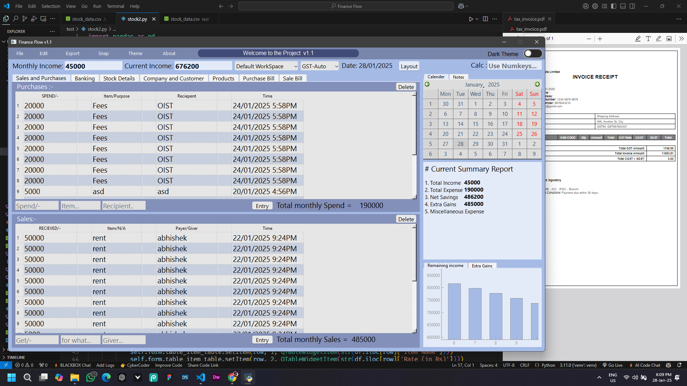

# Finance-Flow-v1.1 Stock Management and Retailing App
Finance Flow software is a fully functional easy to use retailing and stock management software. automatically manages the stocks and transactions during Tax Invoice shipments and services.

Project Images:-
### Stock Images

### Stock Data

### Sales

### Invoice

### Invoice Format

# App Demo Videos
### Stock Data Autosave Feature Demo

### Auto Stock Manage Demo

### Software Demo

### Images Saved with Descriptions

